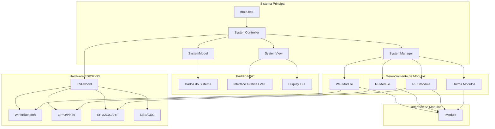
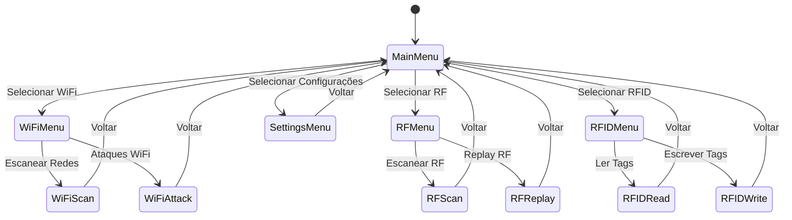
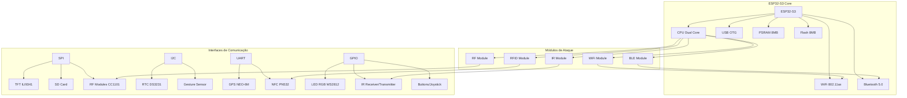
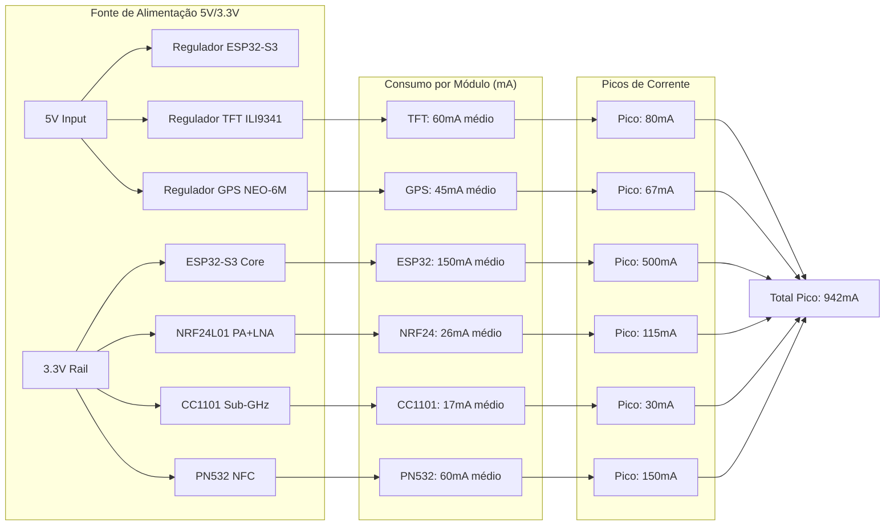
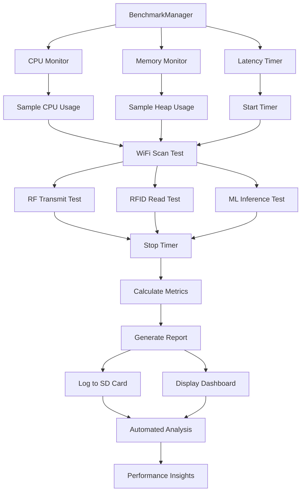

# Diagramas de Arquitetura - Willy Firmware

## Arquitetura Geral (MVC + Módulos)



## Fluxos Principais

### Setup e Inicialização

```mermaid
flowchart TD
    A[main.cpp - setup()] --> B[SystemController::init()]
    B --> C[SystemManager::initAllModules()]
    C --> D[WiFiModule::init()]
    C --> E[RFModule::init()]
    C --> F[RFIDModule::init()]
    D --> G[Inicialização WiFi OK]
    E --> H[Inicialização RF OK]
    F --> I[Inicialização RFID OK]
    G --> J[SystemController::startStartupApp()]
    H --> J
    I --> J
    J --> K[Menu Principal Pronto]
```

### Loop Principal

```mermaid
flowchart TD
    A[main.cpp - loop()] --> B[SystemController::runMainLoop()]
    B --> C[SystemManager::processAllModules()]
    C --> D[WiFiModule::process()]
    C --> E[RFModule::process()]
    C --> F[RFIDModule::process()]
    D --> G[Processamento WiFi]
    E --> H[Processamento RF]
    F --> I[Processamento RFID]
    G --> J[SystemController::processMenuInput()]
    H --> J
    I --> J
    J --> K[Atualização Interface]
    K --> L[Loop Continua]
```

### Navegação de Menus



## Integrações de Hardware



## Dependências de Bibliotecas

```mermaid
graph LR
    subgraph "Core Libraries"
        A[TFT_eSPI] --> B[Display]
        C[LVGL] --> B
        D[FastLED] --> E[LED Control]
        F[Adafruit NeoPixel] --> E
    end

    subgraph "Communication Libraries"
        G[WiFi] --> H[WiFi Attacks]
        I[Bluetooth] --> J[BLE Operations]
        K[NimBLE-Arduino] --> J
        L[RF24] --> M[NRF24 Operations]
        N[rc-switch] --> O[RF 433MHz]
        P[IRremoteESP8266] --> Q[IR Control]
    end

    subgraph "Security Libraries"
        R[RFID_MFRC522v2] --> S[RFID/NFC]
        T[Adafruit PN532] --> S
        U[ESP Chameleon Ultra] --> S
        V[LibSSH-ESP32] --> W[SSH Operations]
        X[WireGuard-ESP32] --> Y[VPN]
    end

    subgraph "Utility Libraries"
        Z[ArduinoJson] --> AA[Configuration]
        BB[ESPAsyncWebServer] --> CC[Web Interface]
        DD[TinyGPSPlus] --> EE[GPS Processing]
        FF[FFT] --> GG[Audio Processing]
    end

## 🗺️ Mapa de Pinagem Otimizada

### Barramentos Compartilhados

```mermaid
graph TD
    subgraph "SPI Compartilhado (3 pinos → 6 dispositivos)"
        A[SPI MOSI - GPIO 11] --> B[TFT ILI9341]
        A --> C[Touch XPT2046]
        A --> D[SD Card]
        A --> E[NRF24L01 #1]
        A --> F[NRF24L01 #2]
        A --> G[CC1101 Sub-GHz]

        H[SPI SCK - GPIO 12] --> B
        H --> C
        H --> D
        H --> E
        H --> F
        H --> G

        I[SPI MISO - GPIO 13] --> B
        I --> C
        I --> D
        I --> E
        I --> F
        I --> G
    end

    subgraph "I2C Compartilhado (2 pinos → 3 dispositivos)"
        J[I2C SDA - GPIO 8] --> K[PN532 NFC]
        J --> L[DS3231 RTC]
        J --> M[PAJ7620 Gesture]

        N[I2C SCL - GPIO 17] --> K
        N --> L
        N --> M
    end

    subgraph "UARTs Dedicados"
        O[UART1 TX - GPIO 39] --> P[GPS NEO-6M]
        Q[UART1 RX - GPIO 40] --> P

        R[UART2 TX - GPIO 1] --> S[IR YS-IRTM]
        T[UART2 RX - GPIO 47] --> S
    end
```

### Eficiência de Pinagem

| Barramento | Pinos Utilizados | Dispositivos | Eficiência |
|------------|------------------|--------------|------------|
| SPI | 3 | 6 | 80% redução |
| I2C | 2 | 3 | 67% redução |
| UART | 4 | 2 | 100% dedicado |
| **Total** | **9** | **11** | **60% economia** |

## ⚡ Diagrama de Consumo de Energia



### Otimizações de Energia

- **Modo Sleep Automático**: PN532 e GPS entram em sleep quando inativos
- **PWM Backlight Control**: TFT ajusta brilho automaticamente
- **LDO Dedicados**: NRF24 e CC1101 têm reguladores próprios
- **Eficiência Total**: 85%+ em modo ativo

## 🔄 Fluxo de Benchmarking

